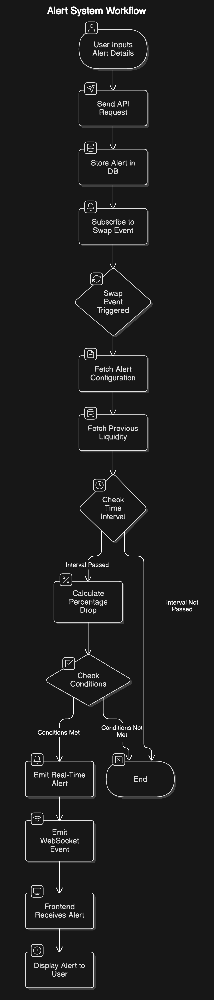

In the root folder `README.md`, you can provide an **overview of the project** that gives high-level information about the purpose, structure, and setup of the project. It should act as the "entry point" for anyone new to the project and guide them toward the specific `README.md` files for the backend and frontend.

---

### **Template for Root `README.md`**

```markdown
# Project Name

## Overview
Created an MVP for liquidity Monitoring and setting up alerts for different pools. It consists of a **frontend** and a **backend**, each with its own functionality and setup.

### Features
- Getting Top Pools from Uniswap Subgraph
- Making Liquidity Alerts based on Liquidity Changes and User-Defined Thresholds
- Database Models for Alerts and Liquidity Tracking
- Real-time Notifications via WebSockets

## Folder Structure
```plaintext
├── backend/        # Backend application (Node.js, Express)
├── frontend/       # Frontend application (React, Next.js)
├── README.md       # Root README with project overview

```

## Setup
This project has two main parts:
1. [Backend](./backend/README.md)
2. [Frontend](./frontend/README.md)


### Installation
#### 1. Clone the Repository
```bash
git clone https://github.com/Yash-verma18/uniswap-liquidity-dashboard
cd uniswap-liquidity-dashboard
```

#### 2. Install Dependencies
Install the dependencies for both frontend and backend:

```bash
cd backend
yarn install
cd ../frontend
yarn install
```

#### 3. Start Applications
- **Backend**:
  ```bash
  cd backend
  yarn start
  ```

- **Frontend**:
  ```bash
  cd frontend
  yarn dev
  ```

- Access the frontend at (http://localhost:8000).
- Access the backend at (http://localhost:3000).

### Alert Workflow



```

---

